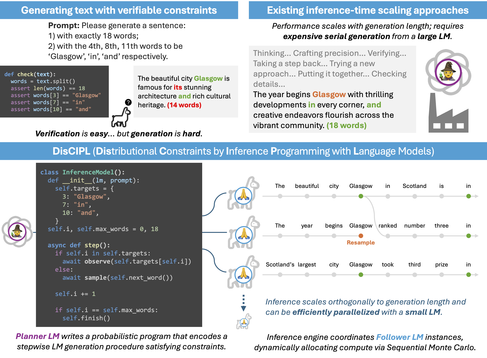

# Self-Steering Language Models

[](https://arxiv.org/abs/2504.07081)
[](https://openreview.net/forum?id=XvCBtm5PgF)
[](https://opensource.org/licenses/MIT)
[](https://www.python.org/downloads/release/python-3100/)

This is the official code repository for the paper [Self-Steering Language Models](https://openreview.net/forum?id=XvCBtm5PgF) by Gabriel Grand, Joshua B. Tenenbaum, Vikash K. Mansinghka, Alexander K. Lew, and Jacob Andreas, presented at the [Second Conference on Language Modeling (COLM 2025)](https://colmweb.org).



## LLaMPPL

Self-steering is built on top of [LLaMPPL](https://github.com/genlm/llamppl), a  probabilistic programming library for language models. We provide a condensed [tutorial on LLaMPPL](disciple/prompts/planner_system_prompt.md) as part of the system prompt for our framework. Readers are encouraged to check out the LLaMPPL documentation for more details.

## Getting Started

```
git clone git@github.com:gabegrand/self-steering.git
```

### With Poetry (Recommended)

This codebase uses [Poetry](https://python-poetry.org/) to manage dependencies. If you don't have Poetry installed, you can do so by following the instructions [here](https://python-poetry.org/docs/#installation).

```bash
cd self-steering
poetry install
```

> [!NOTE]
> If you also want to install optional development dependencies (e.g., for running unit tests, code formatting, and plotting), you can do so with:

```bash
poetry install --with dev
```

Once the installation is complete, you can [activate the virtual environment](https://python-poetry.org/docs/managing-environments/#activating-the-environment):

```bash
# Default with Poetry v2.0
eval $(poetry env activate)

# Alternative with Poetry v1.x or with the poetry-shell plugin
poetry shell
```

## With pip

For convenience, we also provide a [build-system] section in `pyproject.toml`, so you can install the package with pip. We recommend using a virtual environment (e.g., via `venv` or `conda`) to avoid dependency conflicts.

```bash
cd self-steering
pip install -e .
```

### COLLIE

To run experiments on the [COLLIE benchmark](https://github.com/princeton-nlp/Collie), you must first install the COLLIE submodule.

```bash
git submodule update --init -- evaluations/collie_eval/Collie
```

> [!NOTE]
> When you install the COLLIE submodule with the above command, the [COLLIE-v1 dataset](https://github.com/princeton-nlp/Collie?tab=readme-ov-file#overview) is automatically downloaded. Alternatively, you can install `collie-bench` from PyPI and manually download [`data/all_data.dill`](https://github.com/princeton-nlp/Collie/blob/master/data/all_data.dill).

Additionally, inside a Python shell, download `punkt_tab` (required by COLLIE evaluation methods).
```python
import nltk
nltk.download('punkt_tab')
```

### (Optional) Verifying Installation

To check that everything is working correctly, you can run the unit tests (requires the `dev` dependencies):

```bash
pytest tests
```

## Running Experiments

### Overview
- **Pipelines** map to experiment conditions in the [paper](https://arxiv.org/pdf/2504.07081). Each pipeline is defined in [disciple/pipelines.py](disciple/pipelines.py) and configured via JSON files in [disciple/configs](disciple/configs).
- The Planner (paper) corresponds to the `model_generator` in [disciple/model_generators.py](disciple/model_generators.py).
- The Follower is executed inside pipeline `infer()` calls (e.g., `DisciplePipeline`, `VLLMPipeline`, `HuggingFacePipeline`).
- The main entry point is [evaluations/run_benchmark.py](evaluations/run_benchmark.py). Use `--pipelines` to select one or more configs (filenames without `.json`).

### Pipeline groups (config names)
- **DisCIPL (ours)**
  - `disciple` → DisCIPL-SMC
  - `disciple_importance` → DisCIPL-IS (no resampling)
  - `disciple_rejection` → DisCIPL-RS (single-step generation)
- **DisCIPL (oracle variants)**
  - `disciple_oracle_smc`, `disciple_oracle_importance`, `disciple_oracle_rejection` (Planner can peek at expert programs for the target task)
- **Planner-only (OpenAI)**
  - `gpt_4o_mini`, `gpt_4o`, `gpt_4o_cot`, `o1`
- **Follower-only (local/inference backends)**
  - `vllm`, `vllm_beam_search` (uses vLLM)
  - `huggingface`, `huggingface_beam_search` (uses HF Transformers)

### Environment
- Required keys in `.env` (or your environment):
  - `OPENAI_API_KEY=...` (for OpenAI models)
  - `HF_TOKEN=...` (for gated HuggingFace models like Llama-3.x)
- Backend selection: `--backend vllm` (default) or `--backend hf`
- GPU selection: `--device-id 0` sets `CUDA_VISIBLE_DEVICES=0`

### Quick setup of pipeline lists
Each on its own line, with a short description:

```bash
# DisCIPL + baselines
export PIPELINES="disciple disciple_importance disciple_rejection vllm vllm_beam_search gpt_4o_mini gpt_4o o1"

# DisCIPL oracle variants (Planner gets expert programs)
export ORACLE_PIPELINES="disciple_oracle_smc disciple_oracle_importance disciple_oracle_rejection"
```

### Dataset-specific runs
Use `--pipelines` with the config names above (no `.json`). Override models as needed with `--openai-model` and `--huggingface-model`.

#### COLLIE sentence-level tasks
```bash
python evaluations/run_benchmark.py \
  --pipelines ${PIPELINES} \
  --device-id 0 \
  --particles 1 2 4 8 16 32 \
  --max-tokens 32 \
  --timeout 120 \
  --dataset collie \
  --task-types sent_01 sent_02 sent_03 sent_04 \
  --openai-model "gpt-4o-2024-08-06" \
  --huggingface-model "meta-llama/Llama-3.2-1B-Instruct"
```

#### COLLIE paragraph-level tasks
```bash
python evaluations/run_benchmark.py \
  --pipelines ${PIPELINES} \
  --device-id 0 \
  --particles 1 2 4 8 \
  --max-tokens 128 \
  --timeout 240 \
  --dataset collie \
  --task-types para_01 para_02 para_03 para_04 para_05 \
  --openai-model "gpt-4o-2024-08-06" \
  --huggingface-model "meta-llama/Llama-3.2-1B-Instruct"
```

#### Puzzles
```bash
python evaluations/run_benchmark.py \
  --pipelines ${PIPELINES} \
  --device-id 0 \
  --particles 1 2 4 8 16 \
  --max-tokens 512 \
  --timeout 360 \
  --dataset puzzle \
  --repeat 10 \
  --openai-model "gpt-4o-2024-08-06" \
  --huggingface-model "meta-llama/Llama-3.2-1B-Instruct"
```

### Notes on particles (N) and sampling types
- DisCIPL-SMC (and beam search pipelines) are Adaptive: all N values in `--particles` are executed (e.g., 1+2+4+...).
- Importance/Rejection and plain sampling pipelines are Independent: only `max(--particles)` samples are drawn.
- vLLM beam search uses `N` as beam width.

### Resuming and outputs
- Resume a partially completed run: `--resume-from-experiment /path/to/old/results`
- Results directory: `results/<timestamp>/`
  - `results.json`: flattened list of `InferenceResult` entries
  - `pipelines/<pipeline_name>/task_XXXX/completion.json`: raw Planner or model completions (when available)

### Advanced configuration options
- Model generation (Planner) options:
  - `--n-attempts`: number of retries to generate the LLaMPPL program (Planner). In DisCIPL pipelines, feedback from failures is automatically included when `n_attempts > 1`.
  - `--cache-behavior`: controls program reuse in the Planner. See [disciple/model_generators.py](disciple/model_generators.py).
    - `optional` (default): use cached program for a task/version if present; otherwise generate.
    - `require`: load cached program; error if missing.
    - `latest_read_only`: always load the latest cached version; do not generate.
    - `force`: always regenerate a new program (ignores cache).
  - `--load-models-from-path /path/to/prev/results`: reuse programs from a prior experiment. The pipeline will look under that path at `pipelines/<pipeline_name>/model_generator/`.
  - `--debug-mode`: generate a minimal debug model artifact instead of calling the Planner (for development).
  - `--openai-model`: override the Planner model (e.g., `gpt-4o-2024-08-06`).
- Inference (Follower) options:
  - `--huggingface-model`: follower model ID (e.g., `meta-llama/Llama-3.2-1B-Instruct`).
  - `--backend {vllm,hf}`: inference backend for the follower; defaults to `vllm`.
  - `--device-id`: GPU index. Sets `CUDA_VISIBLE_DEVICES`.
  - `--particles`: values of N to evaluate. Adaptive pipelines run all values; independent pipelines run `max(N)`.
  - `--ess-threshold`: resampling threshold for SMC (default `0.5`).
  - `--max-tokens`, `--temperature`, `--timeout`: decoding and runtime limits.
- Dataset control:
  - `--task-types`: restrict to specific tasks (e.g., `sent_01 sent_02`).
  - `--n-examples-per-task-type`: subsample per type (with replacement) for quick tests.
  - `--repeat`: duplicate each task (used in Puzzles).
  - `--seed`: RNG seed.

See all flags in [evaluations/arg_parser.py](evaluations/arg_parser.py).

### LLaMPPL inference models
- DisCIPL-generated programs subclass `BaseModel` in [disciple/base_models.py](disciple/base_models.py).
- Hand-written example models are provided for reference:
  - COLLIE: [evaluations/collie_eval/models.py](evaluations/collie_eval/models.py)
  - Puzzles: [evaluations/puzzle/models.py](evaluations/puzzle/models.py)

### Analysis
All plots and tables were produced in [evaluations/analysis_new.ipynb](evaluations/analysis_new.ipynb). Point the notebook at one or more `results/<timestamp>/` directories to reproduce figures.

## Citation

```bibtex
@inproceedings{
  grand2025selfsteering,
  title={Self-Steering Language Models},
  author={Gabriel Grand and Joshua B. Tenenbaum and Vikash K. Mansinghka and Alexander K. Lew and Jacob Andreas},
  booktitle={Second Conference on Language Modeling},
  year={2025},
  url={https://openreview.net/forum?id=XvCBtm5PgF}
}
```